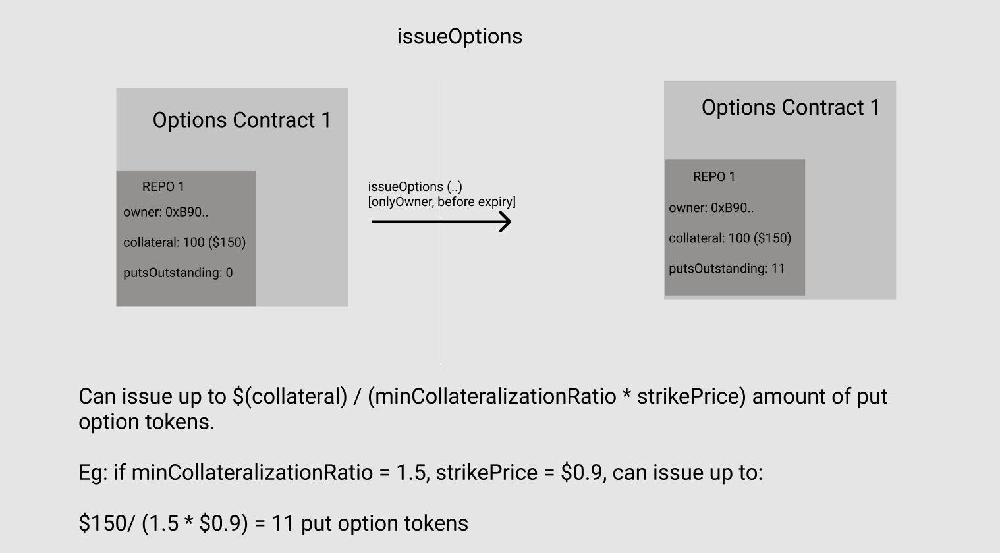
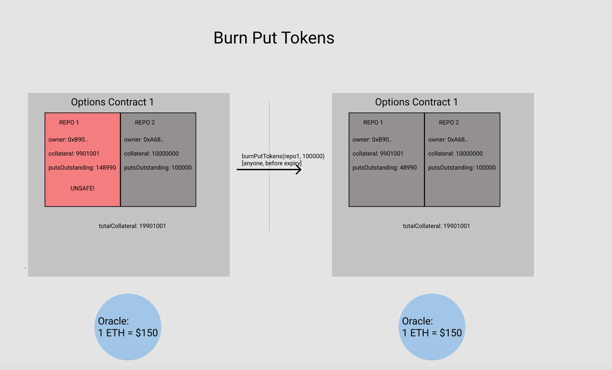
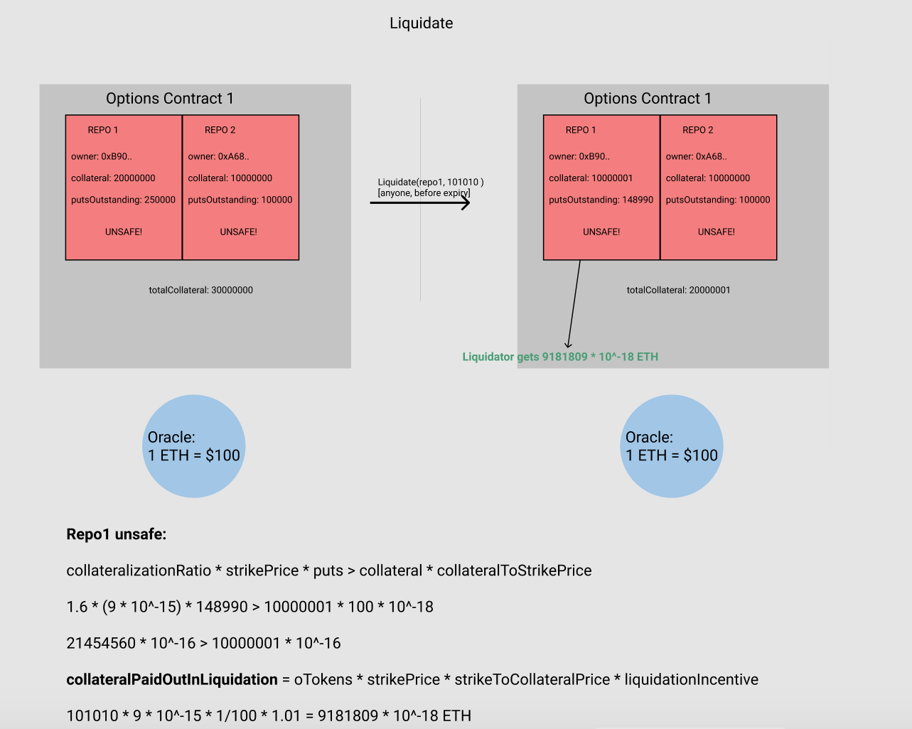
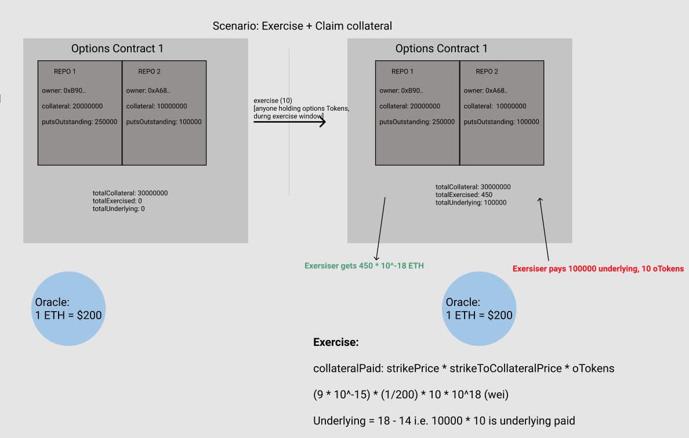
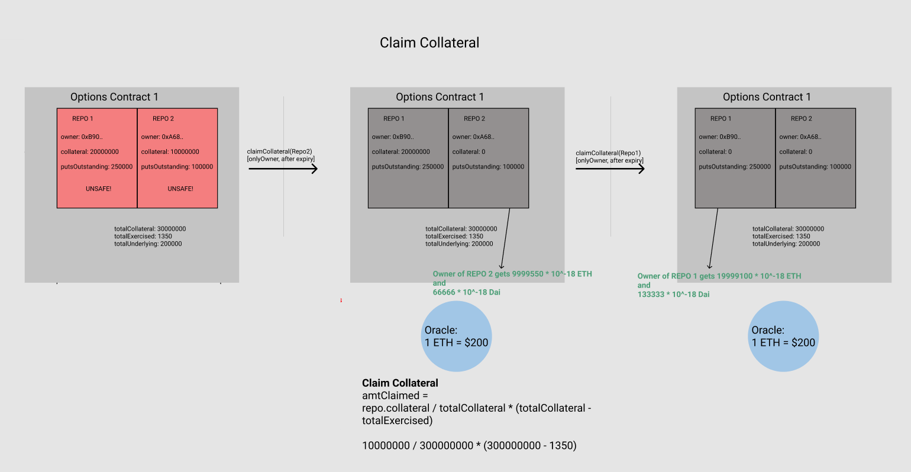

# Convexity Protocol

This vault contains all the smart contracts for the Opyn.co Convexity Protocol. Convexity allows options sellers to earn premiums on their collateral and options buyers to protect themselves against technical, financial and systemic risks that the underlying token faces.

Convexity is a protocol that uses protective put options as insurance. At a high level, the insurance buyer pays the insurance provider some premium ahead of time to get access to oTokens. An example of an oToken is the ocDai token which might protect the holder of the token from Jan 1 2020 to Jan 1 2021 against any disasters that Compound's cDai faces. In the case of a disaster, the holder of the oToken can turn in their oToken and their cDai and in exchange take the collateral locked in the Convexity Protocol by insurance providers. If there is no disaster, it is strictly worse for the holder of cDai to give up their cDai in exchange for collateral locked on the Convexity protocol, thus the insurance providers earn a premium on their collateral

Before diving into the codebase, please read:
- [The Convexity Protocol White Paper](https://drive.google.com/file/d/1YsrGBUpZoPvFLtcwkEYkxNhogWCU772D/view)

# Functionality
The main functionality offered by the convexity protocol is as below:
1. Create oTokens
2. Keep the oToken vaults sufficiently collateralized
3. Liquidate the undercollateralized vaults
4. Exercise the oTokens during the expiry window

## Contracts
### Options Factory
The Options Factory contract instantiates and keeps track of all the Options Contracts that exist. Within each options contract, the ERC20 oTokens are fungible.

### Options Contract
The Options Contract has all the functionality mentioned above built into it. Each Options contract takes in the parameters of `underlying`, `strikePrice`, `expiry`, `collateral` and `windowSize`. Anyone can create an Options Contract.

#### Create oTokens
##### Open vault
oTokens are created by first calling `openVault ()` which instantiates a new vault and sets the owner of that vault to be the `msg.sender`.

##### Add Collateral
Once a vault is opened, anyone can add collateral to the vault by calling `addETHCollateral (vaultIndex)`  or  `addERC20Collateral (vaultIndex)` depending on what the collateral of that contract is.

##### Issue Option Tokens
The owner can then mint oTokens by calling `issueOTokens (vaultIndex, numTokens)`.

#### Keep the oToken vaults sufficiently collateralized
vault owners can ensure their vaults are sufficiently collateralized in 2 ways.

##### Add Collateral
The first way is adding more collateral by calling `addETHCollateral (vaultIndex)`  or  `addERC20Collateral (vaultIndex)`. See the section on [addCollateral](#addCollateral) above.

##### Burn Tokens
vault owners can also burn oTokens to increase the collateralization ratio by buying back oTokens from the market and then calling `burnOTokens (vaultIndex, amtToBurn)`.

#### Liquidate the undercollateralized vaults

Liquidation happens by calling `liquidate(vaultIndex, _oTokens)`. All vaults need `collateralizationRatio * strikePrice * puts <= collateral * collateralToStrikePrice` to be safe.

If that condition fails, a liquidator can come with `_oTokens`. The liquidator gets `_oTokens * strikePrice * (incentive + fee)` amount of collateral out. They can liquidate a max of `liquidationFactor * vault.collateral` in one function call i.e. partial liquidations.

#### Exercise the oTokens during the expiry window
##### Exercise
Any oToken holder can call `exercise (oTokens)` during the exercise window and in return get out strike price amount of collateral. Note that since they are receiving the payment in the collateral asset, they should exchange it immediately for the strike asset to protect themselves against volatility.  If the oToken holder wants to exercise before the exercise window, they can sell their oTokens on any exchange like Uniswap etc.

##### Claim Collateral
After the contract expires, the insurance providers can collect their collateral back. The amount they receive is calculated as `vault.collateral / totalCollateral * (totalCollateral - totalExercised)`. The oTokens expire so don't have to be burned as they no longer have any value. vaults can't be unsafe after expiry because they no longer have a promised insurance amount.

# Installing dependencies

Run `npm install` to install all dependencies.

# Testing
Run `ganache-cli` to first have ganache running
Run `npm test` to execute the test suite.
