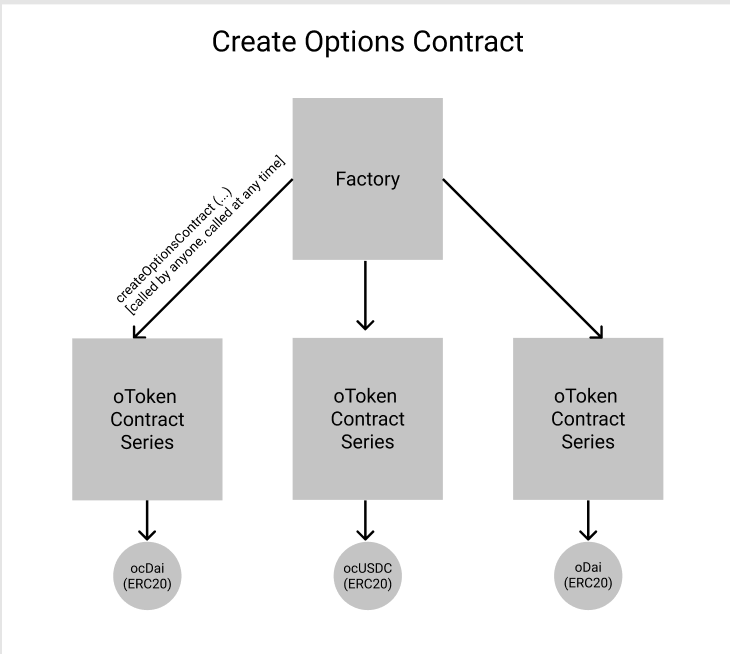
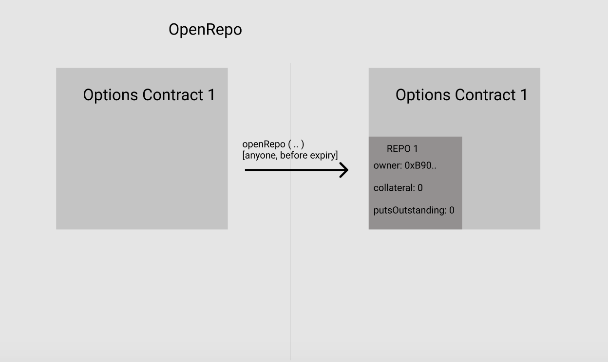
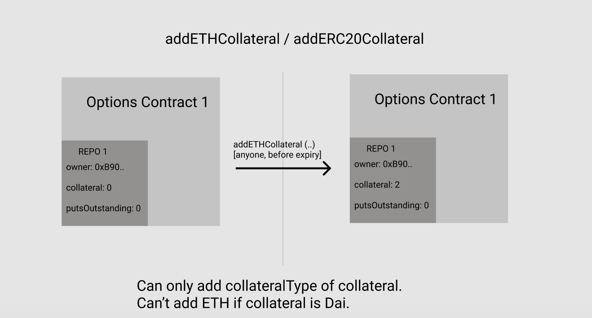

# Convexity Protocol

This repo contains all the smart contracts for the Opyn.co Convexity Protocol. Convexity allows options sellers to earn premiums on their collateral and options buyers to protect themselves against technical, financial and systemic risks that the underlying token faces. 

Convexity is a protocol that uses protective put options as insurance. At a high level, the insurance buyer pays the insurance provider some premium ahead of time to get access to oTokens. An example of an oToken is the ocDai token which might protect the holder of the token from Jan 1 2020 to Jan 1 2021 against any disasters that Compound's cDai faces. In the case of a disaster, the holder of the oToken can turn in their oToken and their cDai and in exchange take the collateral locked in the Convexity Protocol by insurance providers. If there is no disaster, it is strictly worse for the holder of cDai to give up their cDai in exchange for collateral locked on the Convexity protocol, thus the insurance providers earn a premium on their collateral

Before diving into the codebase, please read: 
- [The Convexity Protocol White Paper](https://drive.google.com/file/d/1YsrGBUpZoPvFLtcwkEYkxNhogWCU772D/view)

# Functionality
The main functionality offered by the convexity protocol is as below: 
1. Create oTokens
2. Keep the oToken repos sufficiently collateralized
3. Liquidate the oToken repos is they get undercollateralized
4. Exercise the oTokens during the expiry window

## Contracts 
### Options Factory
The Options Factory contract instantiates and keeps track of all the Options Contracts that exist. Within each options contract, the ERC20 oTokens are fungible. 

### Options Contract
The Options Contract has all the functionality mentioned above built into it. Each Options contract takes in the parameters of `underlying`, `strikePrice`, `expiry`, `collateral` and `windowSize`. Anyone can create an Options Contract. 

#### Create oTokens
oTokens are created by first calling `openRepo ()` which instantiates a new repo and sets the owner of that repo to be the `msg.sender`.

Once a repo is opened, anyone can add collateral to the repo by calling `addETHCollateral (repoIndex)`  or  `addERC20Collateral (repoIndex)` depending on what the collateral of that contract is. 

The owner can then mint oTokens by calling `issueOptionTokens (repoIndex, numTokens)`.

# Installing dependencies

Run `npm install` to install all dependencies.

# Testing

Run `npm test` to execute the test suite.